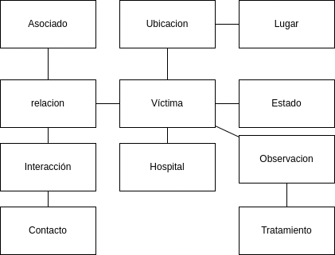
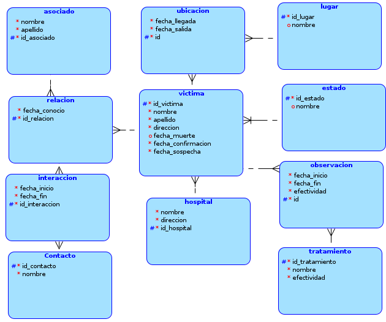
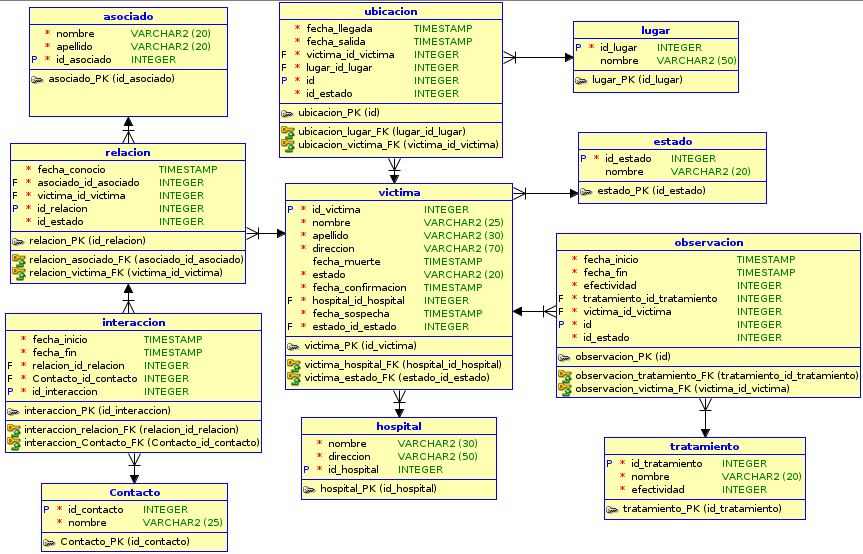

# SBD1_Proyecto1
Proyecto del curso Sistemas de bases de datos 1, primer semestre 2023

|            Nombre          |  Carnet   |
| -------------------------- | --------- |
| Carlos Daniel Acabal Pérez | 202004724 |

El presente manual describe cómo funciona la Api, los modelos utilizados, scripts sql y la base de datos usada
## Requisitos
- [Nodejs](https://nodejs.org/en/)
- [Docker Desktop](https://www.docker.com/products/docker-desktop/)
## Configuración local
```bash
cd api/
npm i
npm run dev
```
### API
Fue desarrollada en NodeJs utilizando Express, está corriendo en el puerto definido por la variable de entorno
```bash
PORT=5000
```
#### Conexión a base de datos
Se utilizó el modulo [oracledb](https://www.npmjs.com/package/oracledb) para realizar las consultas a la base de datos,
las credenciales usadas se encuentran en un archivo .env.
```bash
DB_USER=ejemplo
DB_PASSWORD=secreto
URL={ip}/{SID}
```
#### Endpoints
|          Endpoint          |  Descripción   |
| -------------------------- | -------------- |
| /consulta[0-10] | Muestra la consulta de [reports.sql](./api/queries/reports.sql) |
| /cargarTemporal | Carga masiva de datos a tabla temporal, [data.csv](./api/DB_Excel.csv) |
| /cargarModelo   | Crea tablas del modelo y carga datos |
| /eliminarTemporal | Elimina datos de la tabla temporal |
| /eliminarModelo | Elimina las tablas del modelo de datos |
 
#### Consultas SQL
Todas las sentencias DML y DDL se encuentran en scripts sql:
- [Cargar Temporal](./api/queries/loadData.sql)
- [Cargar Modelo](./api/queries/createModel.sql)
- [Consultas](./api/queries/reports.sql)
- [Eliminar modelo](./api/queries/deletemodel.sql)
    
Dentro de la api se utilizó el módulo [fs](https://www.w3schools.com/nodejs/nodejs_filesystem.asp) para leer los scripts sql y ejecutarlos con el módulo oracledb,
con el fin de mantener ordenado el código del [controlador](./api/controller/controller.js)
### Base de datos
La base de datos utilizada fue oracle, para ello se usó Docker, específicamente la 
imágen de [Enterprise](https://container-registry.oracle.com/), crear un archivo .env y agregar las siguientes variables con los valores necesarios:
```bash
ORACLE_SID=EJEMPLO
ORACLE_PDB=EJEMPLO2
ORACLE_PWD=secreto123
```

Ejecutar el siguiente comando:
```bash
docker compose up
```
### Modelos para base de datos
Se utilizó la herramienta [draw.io](https://app.diagrams.net/) para crear el modelo conceptual, además se utilizó la herramienta [Data Modeler](https://www.oracle.com/database/sqldeveloper/technologies/sql-data-modeler/download/) para el modelo lógico y relacional
#### Modelo conceptual

#### Modelo lógico

#### Modelo relacional

